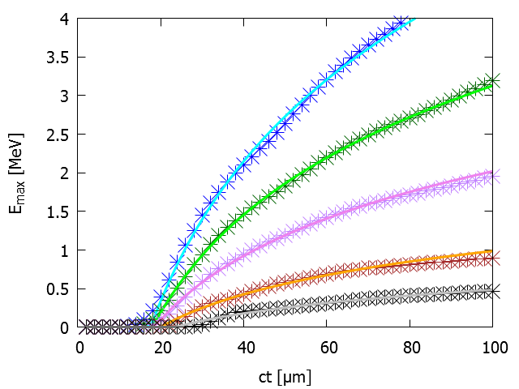

## Rise time of proton cut-off energy in 2D and 3D PIC simulations  
#### J. Babaeiº, L. A. Gizzi¹, P. Londrillo², S. Mirzanejadº, T. Rovelli³, S. Sinigardi³, G. Turchetti³  
ºDepartment of Physics, Faculty of Basic Sciences, University of Mazandaran, Babolsar, Iran   
¹INO/CNR Pisa  
²INAF, Osservatorio Astronomico Bologna   
³Dipartimento di Fisica e Astronomia, Università di Bologna, INFN Sezione di Bologna, Via Irnerio 46, I-40126 Bologna (BO), Italy   

[arXiv:1611.08381](https://arxiv.org/abs/1611.08381)  
*submitted to Physics of Plasmas*

The Target Normal Sheath Acceleration (TNSA) regime for proton acceleration by laser pulses is experimentally consolidated and fairly well understood. However, uncertainties remain in the analysis of particle-in-cell (PIC) simulation results.

The energy spectrum is exponential with a cut-off, but the maximum energy depends on the simulation time, following different
laws in two and three dimensional (2D, 3D) PIC simulations, so that the determination of an asymptotic value has some arbitrariness. 

We propose two empirical laws for rise time of the cut-off energy in 2D and 3D PIC simulations, suggested by a model in which the proton acceleration is due to a surface charge distribution on the target rear side. The kinetic energy of the protons that we obtain follows two distinct laws, which appear to be nicely satisfied by PIC simulations, for a model target given by a uniform foil plus a contaminant layer hydrogen-rich. The laws depend on two parameters: the scaling time, at which the energy starts to rise, and the asymptotic cut-off energy. 

The values of the cut-off energy, obtained by fitting 2D and 3D simulations for the same target and laser pulse configuration, are comparable. This suggests that parametric scans can be performed with 2D simulations, since 3D ones are computationally very expensive, delegating their role only to a correspondence check. In this paper, the simulations are carried out with the PIC code [ALaDyn](http://aladyn.github.io/ALaDyn/) by changing the target thickness *L* and the incidence angle α, with a fixed a₀=3. A monotonic dependence, on *L* for normal incidence and on α for fixed *L*, is found, as in the experimental results for high temporal contrast pulses.

- [ALaDyn Collaboration Papers](https://aladyn.github.io/Papers)

