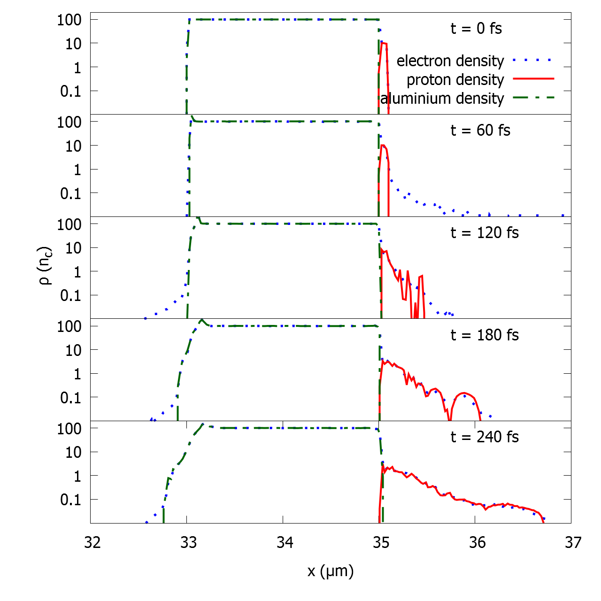
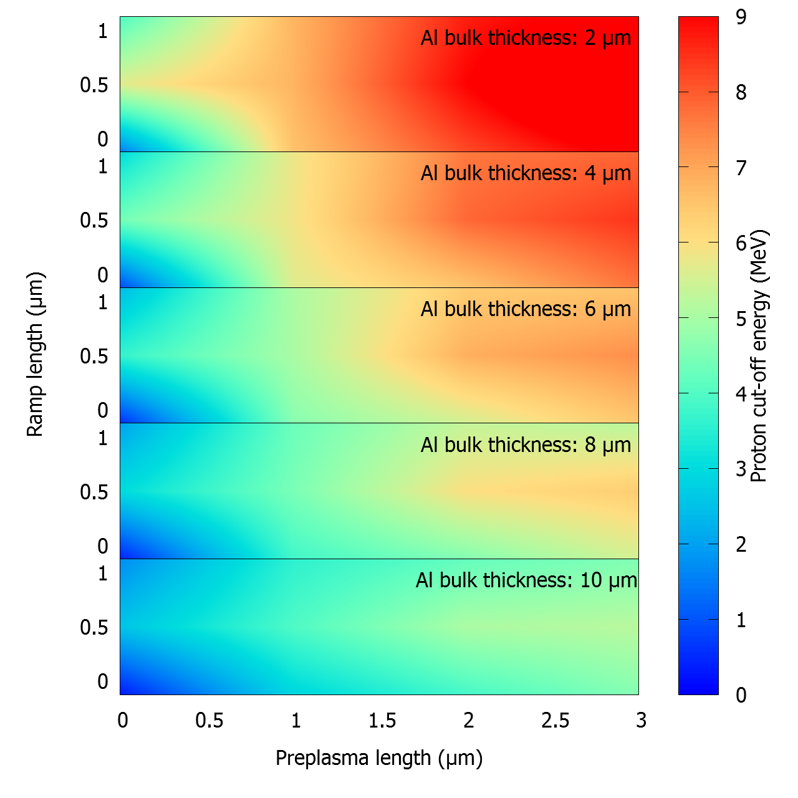

## Numerical simulations of recent proton acceleration experiments with sub-100 TW laser systems  
#### S. Sinigardi¹  
¹Dipartimento di Fisica e Astronomia, Università di Bologna, INFN Sezione di Bologna, Via Irnerio 46, I-40126 Bologna (BO), Italy   

[Nucl. Instr. and Meth. A, 829, 167 (2015)](http://www.sciencedirect.com/science/article/pii/S0168900216301620)  

Recent experiments carried out at the Italian National Research Center, National Optics Institute Department in Pisa, are showing interesting results regarding maximum proton energies achievable with sub-100 TW laser systems. While laser systems are being continuously upgraded in laboratories around the world, at the same time a new trend on stabilizing and making ion acceleration results reproducible is growing in importance. Almost all applications require a beam with fixed performance, so that the energy spectrum and the total charge exhibit moderate shot to shot variations. This result is surely far from being achieved, but many paths are being explored in order to reach it. Some of the reasons for this variability come from fluctuations in laser intensity and focusing, due to optics instability. Other variation sources come from small differences in the target structure. The target structure can vary substantially, when it is impacted by the main pulse, due to the prepulse duration and intensity, the shape of the main pulse and the total energy deposited. In order to qualitatively describe the prepulse effect, we will present a two dimensional parametric scan of its relevant parameters. A single case is also analyzed with a full three dimensional simulation, obtaining reasonable agreement between the numerical and the experimental energy spectrum.

- [ALaDyn Collaboration Papers](https://aladyn.github.io/Papers)

